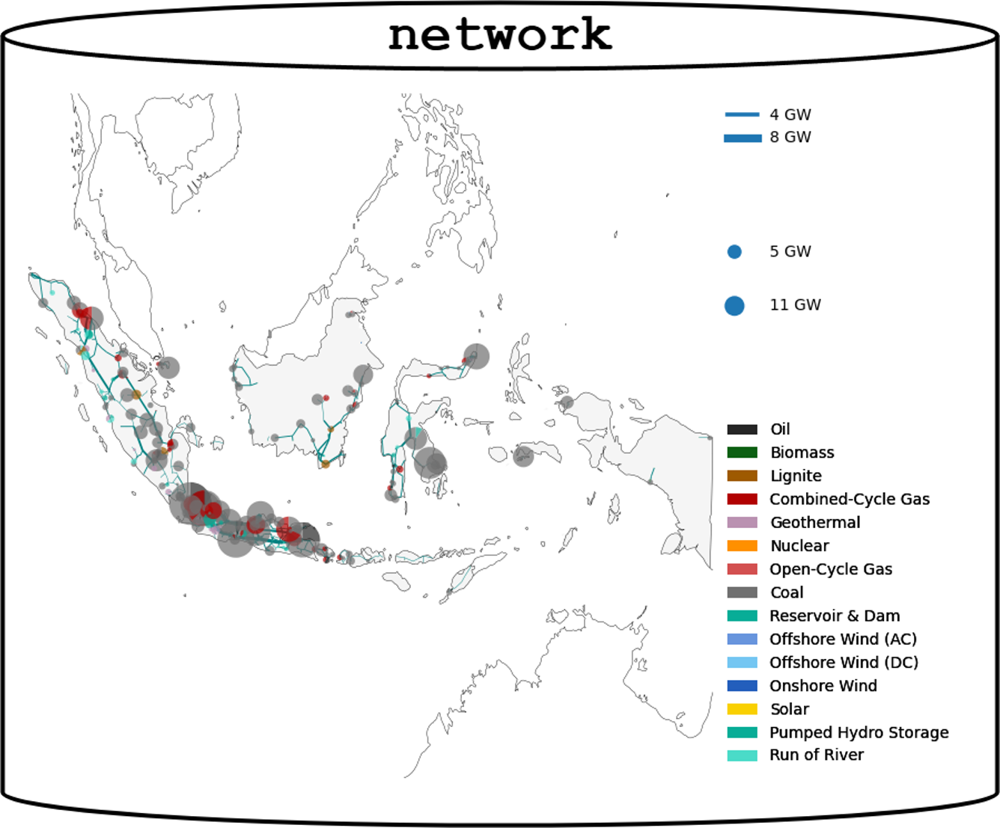
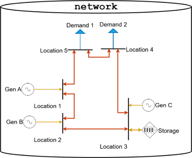
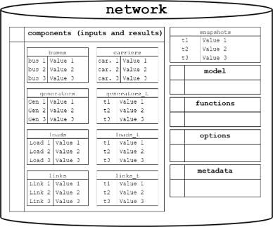
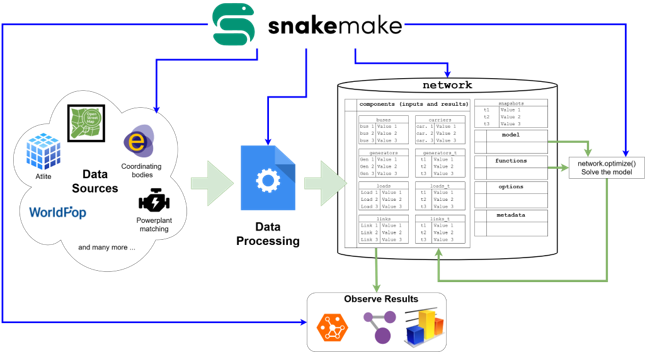

# ⚡ Introduction to PyPSA Modeling

This repository was developed for the [Gurobi Energy Innovation Summit](https://www.gurobi.com/microsite/2025-energy-innovation-summit/) co-hosted by [Open Energy Transition](https://openenergytransition.org) and [Gurobi](https://www.gurobi.com). It introduces users to the core concepts of power system modeling using the [PyPSA](https://pypsa.org) toolbox and provides a hands-on training notebook that runs directly in [Google Colab](https://colab.research.google.com).

---

## 🧠 Key Concepts

### 1️⃣ Energy Systems as Networks  
Energy systems can be represented as network models that describe how energy flows across infrastructure.

---

### 2️⃣ Components in PyPSA  
A PyPSA network is built from components such as `buses`, `lines`, `links`, `generators`, and `loads`.

---

### 3️⃣ The PyPSA Model  
A PyPSA `Network` object contains:
- **Data** (stored as pandas DataFrames),
- **Methods** (for simulation, optimization, etc.),
- **Constraints** (that define system behavior), and
- **Solver options** (to control optimization settings).

---

### 4️⃣ Reproducible Workflows with Snakemake  
Large-scale modeling efforts benefit from structured workflows. We use [Snakemake](https://snakemake.readthedocs.io) to manage the end-to-end process—from data collection to model solving and results analysis.

The typical modeling workflow includes:
- Data collection and import  
- Constraint formulation and application  
- Model solving  
- Results review and analysis  

🔁 **Green arrows** represent process flow  
🔷 **Blue arrows** represent coordination between steps

> 🧩 Note: Snakemake workflows are **not covered** in this notebook. For full-featured modeling environments, refer to:
> - [PyPSA-Eur](https://github.com/PyPSA/pypsa-eur)  
> - [PyPSA Meets Earth](https://github.com/PyPSA/pypsa-earth)  

---

## 📓 About This Repository

This repository includes:

- A **training notebook** that introduces the PyPSA framework and walks through building a basic energy system model.
- A **blank Excel template** for creating your own model.
- A **complete example** of a simplified South African power system divided into 9 provincial nodes and connected using `links`.

The notebook is **self-contained** and designed to run in **Google Colab**, so no local setup is needed.

Users are encouraged to refer to the official [PyPSA documentation](https://pypsa.readthedocs.io) for detailed guidance on model components, usage, and advanced features.

---

## ☁️ Running in Google Colab

Google Colab provides a virtual machine in the cloud. However:

- All data and installed packages are lost when a session ends.
- To preserve your work, the notebook:
  - Mounts your **Google Drive** to save files persistently.
  - Optionally pulls the latest version of this GitHub repository.
  - Creates timestamped **backups** of your existing work when pulling updates.

⚠️ To use these features, you will need a **Google account** and will be asked to authorize access to your Drive.

> 🔒 Concerned about security? See [Google Colab – Drive Access Permissions](https://research.google.com/colaboratory/faq.html#drive) for more details.

---

## 🛠️ Get Started

Open the notebook in Colab using the badge below:

---

## 📬 Contact

For questions, reach out to [Open Energy Transition](https://openenergytransition.org/contact).
